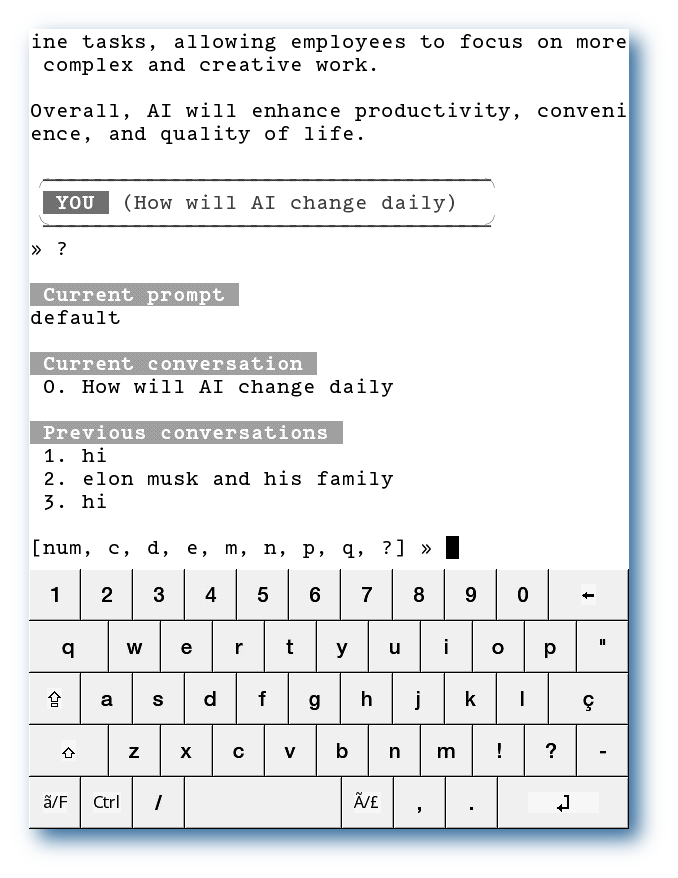
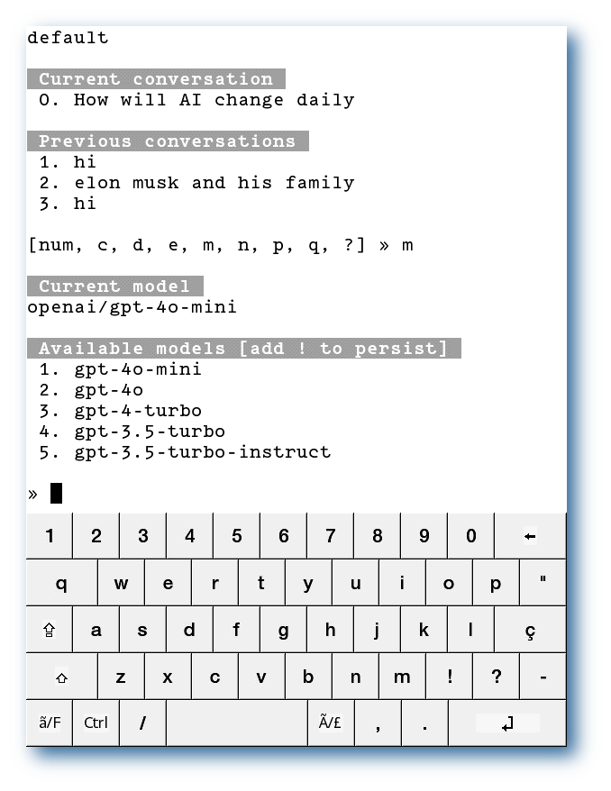
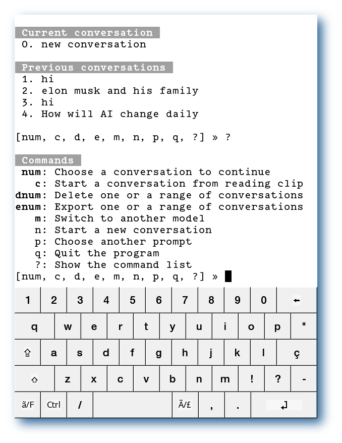

[English](readme.md) · __简体中文__

---

# 简介
**Inkwell**是一个运行于终端的Ai助手，主要为Kindle设计，也适用于其他系统的终端
1. **Python >= 3.8**
2. 单文件设计，不依赖任何第三方库
3. 支持在终端显示格式化后的markdown文本
4. 支持对Kindle读书摘要笔记(My Clippings)进行AI总结和提问学习
5. 支持将会话历史导出为格式良好的电子书或发送至邮件
6. 支持openai/google/xai/anthropic/mistral/groq/perplexity/alibaba
7. 支持多个api key自动轮换
8. 支持多个api服务器自动轮换


**屏幕截图**    
    
    
    


# 安装
1. 确保Kindle已经越狱，并且安装了**KUAL**和 [Python3](https://www.mobileread.com/forums/showthread.php?t=225030)
2. 将`inkwell.zip`解压到Kindle书籍根目录(`/mnt/us`)

# 配置
有两种配置方法，任选其一：    
1. 在电脑上直接打开inkwell目录下的 `config.json`，填写对应字段，然后拷贝到Kindle
2. 点击KUAL菜单项`Inkwell Setup`，然后根据向导完成配置过程，不明白的步骤直接回车即可

## 配置项说明
- **provider**: 提供AI服务的公司。`openai/google/xai/anthropic/mistral/groq/perplexity/alibaba`
- **model**: 每个AI服务提供的Model
- **api_key**: Api秘钥，可以多个，使用分号分隔
- **api_host**: 如果是第三方提供的API服务，可以填写此项，多个地址使用分号分隔
- **display_style**: 文本显示模式。
    - `markdown` - 格式化markdown文本；
    - `markdown_table` - 格式化markdown文本和表格；
    - `plaintext` - 显示为纯文本
- **chat_type**: API会话模式。
    - `multi_turn` - 正常的多轮对话模式；
    - `single_turn` - 针对一些不支持多轮对话的第三方API服务，程序内使用字符串拼接模拟多轮对话
- **token_limit**: 输入上下文token限制，不建议填写太大
- **max_history**: 保存的历史会话个数。每个会话里面的轮数不受限
- **prompt**: 会话使用的系统prompt名字，
    - `default/custom`为特殊值；
    - 其他为`prompts.txt`的自定义名字
- **custom_prompt**: 如 `prompt="custom"`，则使用此配置
- **smtp_sender**: 可选，邮件发送人地址
- **smtp_host**: 可选，SMTP服务器地址和端口，比如: `smtp.gmail.com:587`
- **smtp_username**: 可选，SMTP用户名
- **smtp_password**: 可选，SMTP秘钥


# 用法
1. 点击KUAL对应菜单项进入，不需要提前打开WIFI，脚本会自动开启WIFI，退出时自动关闭WIFI
2. 点击有`Clippings`字样的菜单项会马上可以选择读书摘要进行AI提问
3. 支持发送多行文本，输入一个空行启动发送
4. 任何时候输入 `?` 进入菜单界面，`q` 退出


# 其他功能说明
## 针对读书摘要进行AI提问
Inkwell有一个比较方便的功能，在读书过程中碰到不懂的或需要了解更多背景信息的内容，在阅读界面选择对应的内容后，进入Inkwell的`clippings`界面，显示最近的9个摘要（9为最新的），可以将一个或多个摘要文本发送给AI，并且进行多轮提问。    
这是比较重要的功能，所有有多个入口点，任选一个：    
1. 启动参数 `--clippings`
2. 主界面输入 `c`
3. 菜单界面输入 `c`


## 导出会话
Inkwell运行于kterm终端，Kterm滚动体验不是很好，如果碰到多轮的长对话，很难查看稍久之前的信息，而且kterm的显示缓冲区也有限，太长的会话就看不到更前面的内容了。   
将会话导出为电子书后，使用Kindle内置阅读器打开，阅读和跳转体验会更好，还可以查词或永久保存。    
可以导出单个或多个会话为一本电子书，示范命令格式如下，每个命令执行完成后，Kindle的书库界面会自动出现对应图书：   
如果需要，还可以将导出的电子书发送至电子邮箱（需要提前设置配置文件中以 `smtp` 开头的四个配置项）   
```
e0: 导出当前会话
e1: 导出第一个历史会话
e1-3: 导出第一到第三个历史会话
e1,3-5: 导出第一个，第三个，第四个，第五个历史会话
```


## 菜单界面的命令简介
* `数字0`：回到当前会话
* `数字1及以上`：切换到某个历史会话，然后继续聊天
* `c`：进入`clippings`界面，选择某个读书摘要或笔记发送给AI并进行提问
* `d开头`：删除某个或某些历史会话，`d0`, `d1`, `d1-3`, `d1,3-5`
* `e开头`：导出某个或某些历史会话为电子书，`e0`, `e1`, `e1-3`, `e1,3-5`
* `m`：选择其他model，默认为临时，下次启动恢复原先model，如果需要保存到配置文件，在数字后添加一个叹号
* `n`：新建一个会话
* `p`：选择其他prompt，可以参考下面的“自定义prompt”章节
* `q`：退出程序
* `?`：显示命令帮助


## 自定义prompt
Inkwell支持方便切换prompt     
1. 可以在配置时输入 `Custom prompt`
2. 可以手动编辑配置文件，在 `custom_prompt` 区段填写，然后将 `prompt` 修改为 `custom`
3. 在`inkwell.py`同目录下创建文件 `prompts.txt`，可以写入多个prompt，然后在程序内切换，格式为
```
prompt_name
content line1
content line2
...
</>
another_prompt_name
content line1
...
</>
...
```


# 其他信息
1. Inkwell运行于kterm上，kterm的基本操作是双指点按弹出菜单，可以缩放字体大小，打开关闭键盘，屏幕旋转等
2. AI聊天对键盘要求比较高，如果对默认键盘布局不满意，可以使用作者的 [kterm键盘设计器](https://github.com/cdhigh/kterm_kb_layouter) 来制作自定义的布局。

